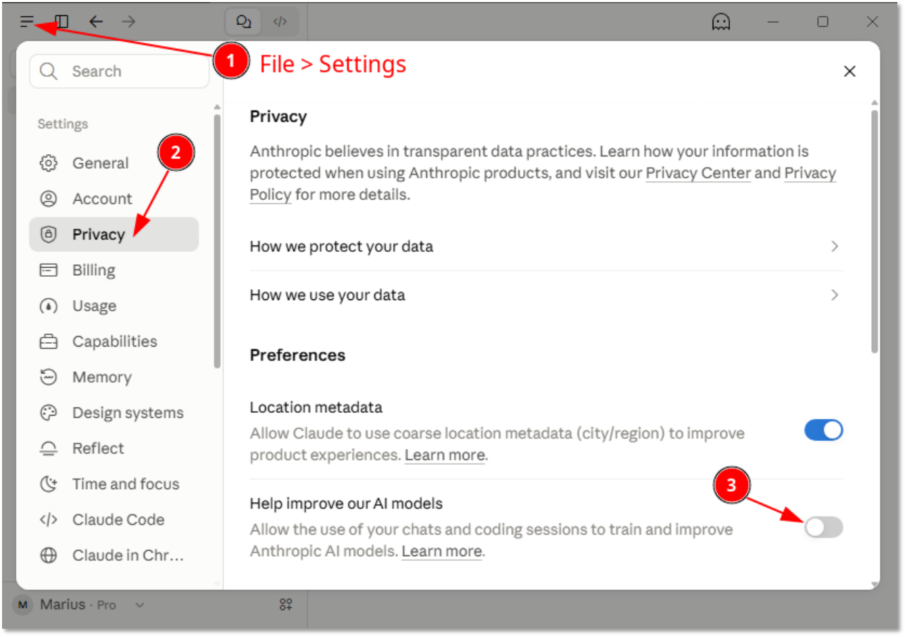
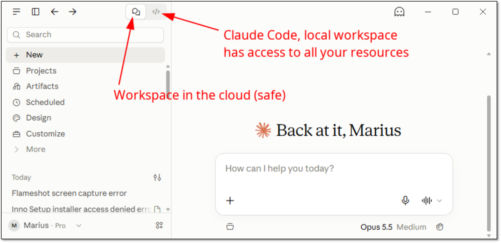
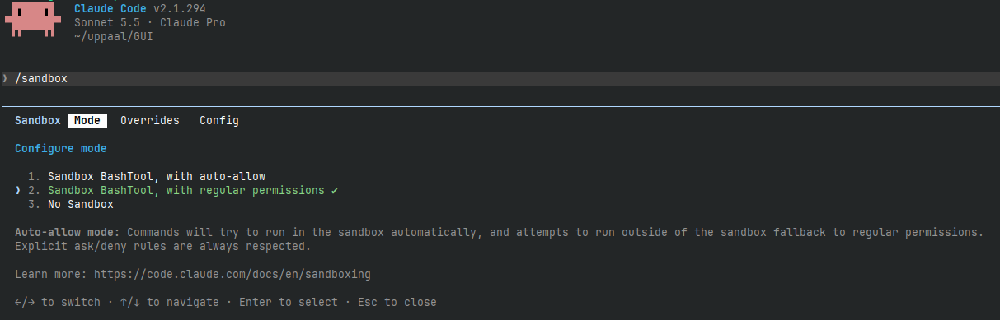

# Best Practices for using LLMs and AI Safely

## What could possibly go wrong?

**AI is not evil (yet), but *Ambiguity* leads to [*Unintended* Consequences](https://en.wikipedia.org/wiki/Unintended_consequences) and [Murphy's Law](https://en.wikipedia.org/wiki/Murphy%27s_law).**

 * AI agents are increasingly *proactive*: often *guess* and *implement* **without consulting** their user.
 * Prompts like `is XYZ possible?` or `how can XYZ be done?` **may modify files**
   - Prompt acts as a working hypothesis: AI implements and provides a proof, without a proof it speculates.
   - Instead, you may just give a (vague) order: `perform/implement XYZ`
   - Better: `give me an overview of possible solutions`, `what are options and their pros and cons?`
      - forces AI to compile a list/table of various approaches, so you can make informed choices.
      - may provide (new) options and insights that you overlooked or they did not exist before.
 * `implement XYZ` (but you “forgot” to provide infrastructure and/or specify details)
   - AI may *assume* some infrastructure and attempt to use it and **fail**, but instead of stopping/consulting:
   - AI may *search* the **project folder**, the **entire computer**, then **entire internet**...
   - AI may *spend lots of tokens* for analysing unnecessary/unrelated material.
   - AI may *find* and **(re)use** material that was not meant to be (re)used, **may violate copyright law**.
   - AI may *upload* the material into cloud for analysis (*more tokens*) and/or training (*leak* and **distribute**).
   - AI may **attack** some system if it believes that it has something ([OpenAI – HuggingFace 2026-07](https://en.wikipedia.org/wiki/OpenAI%E2%80%93HuggingFace_incident)).


## Principles for Containment

 * Specify how your material can (**not**) be used: *Settings* > *Privacy* > *Retention* / *Training*
 * Run AI in the *cloud*: *let it use its own workspace*, download artefacts, connect to repos etc.
 * Run AI in a *virtual container*:
   - (Re)use an *image* with all the common tools/infrastructure preinstalled.
   - Spin up a *separate container* for each project (do not mix projects that are not meant to be mixed).
   - ***DO NOT INSTALL PASSWORDS** and/or **KEYS**.
   - Use i*nteractive shell*, *ssh*, *forward X*, but ***DO NOT FORWARD AUTHENTICATION AGENTS***
   - *Mount* your project folder using container tools:
      - AI accesses the *project folder* & internal *public data* (OK with find, grep, awk, even git add/commit/checkout, ...)
      - User uses *outside access* with *external tools* & **keys** (git clone/push/pull) (AI should not reach)
 * Use version control
   - Cheap to experiment and undo the mess (`git restore ...`)
 * Provide instructions to AI how to treat your project
   - **AGENTS.md** - how to compile, test, "don’t go outside", "ask for missing tools".
   - Usually the AI will offer user to analyse the project and produce such a file. Later it can be amended.
 * Ask LLM “What are the best practices of running Claude Code with respect to containment?”
   - Enable `/sandbox` - **off by default!** (`sudo apt install ripgrep socat bubblewrap seccomp`)
   - AI may retry with **dangerouslyDisableSandbox**. Disable: set `"allowUnsandboxedCommands": false`
   - ...


## Specific Instructions

### Claude Desktop
Training can be turned off in the Privacy Settings:


By default, Claude Desktop uses the remote workspace (project files) in the cloud.
Just like web interface, Claude Desktop does not have access to local resources unless the resources are uploaded.

Claude Desktop also includes Claude Code which *has access* to **all the local resources**, hence risky.

Claude Code can be switched to by using the widget at the top of the window:



Claude Code can also be [installed separately as a command line utility `claude`](https://code.claude.com/docs/en/quickstart):




## Virtualization

### Docker

The following instructions assume that your project files are in `$PWD/home/$USER/project`:
 - `$PWD` is your current directory (a subdirectory, not your real home!)
 - `$USER` is your user name (assuming that you want to keep the name also in the container)
 - `$PWD/home` is going to be mounted in the container and shared.
 - The folder is not part of container itself, so it will not accupy extra space under container storage.
 - Allows easy restart and reuse of your settings across containers (`.bashrc`, `.local`, `.config`, `.cache` etc).
 - Do not mount your `/home/$USER`! It will expose all your files to AI.
 - Create such a directory structure:
 ```shell
 mkdir -p $PWD/home/$USER/project
 ```

Example Dockerfiles (contains mostly C/C++/Java development and some extra tools, feel free to modify), choose one and download the files:
 * [Ubuntu 24.04 LTS](docker/ub24-dev.Dockerfile), depends on [entrypoint.sh](docker/entrypoint.sh) for setting up user name & password.
    - Build an image to be called `ub24-dev`:
      ```shell
      docker build -f ub24-dev.Dockerfile -t ub24-dev .
      ```
    - Spin up a container named `dev24` and expose its `ssh-server` on host port `2404`, and with project home directory mounted, remember to change the password (for `ssh` to container):
      ```shell
      docker run -d --hostname dev24 --name "dev24" -p 127.0.0.1:2404:22  \
         --mount type=bind,src=$PWD/home,dst=/home -e USERNAME=$USER -e USERID=$(id -u) -e GROUPID=$(id -g)  \
         -e PASSWORD=changeme ub24-dev
      ```
    - Test the connection, use the password from the step above:
      ```shell
      ssh -p 2404 localhost
      ```
    - Simplify `ssh` access by adding `dev24` container to your `~/.ssh/config`:
      ```ssh_config
      Host dev24
      ForwardX11Trusted yes
      ForwardAgent no
      Hostname localhost
      Port 2404
      User marius
      IdentityFile ~/.ssh/id_rsa
      PreferredAuthentications publickey,keyboard-interactive,password
      ```
    - Copy your public ssh key to `dev24`:
      ```shell
      ssh-copy-id ~/.ssh/id_rsa.pub dev24
      ```
    - Try connecting again:
      ```shell
      ssh dev24
      ```
    - If something goes wrong (construction worker unplugs your PC), list the running containers:
      ```shell
      docker ps
      ```
    - List all containers (including stopped ones):
      ```shell
      docker ps -a
      ```
    - Restart `dev24` container if it was stopped:
      ```shell
      docker restart dev24
      ```
    - Stop `dev24` container:
      ```shell
      docker stop dev24
      ```
 * [Ubuntu 26.04 LTS](docker/ub26-dev.Dockerfile), depends on [entrypoint.sh](docker/entrypoint.sh) for setting up user name & password.
    - Build an image to be called `ub26-dev`:
      ```shell
      docker build -f ub26-dev.Dockerfile -t ub26-dev .
      ```
    - Spin up a container named `dev26` and expose its `ssh-server` on host port `2604`, and with project home directory mounted, remember to change the password (for `ssh` to container):
      ```shell
      docker run -d --hostname dev26 --name "dev26" -p 127.0.0.1:2604:22  \
         --mount type=bind,src=$PWD/home,dst=/home -e USERNAME=$USER -e USERID=$(id -u) -e GROUPID=$(id -g)  \
         -e PASSWORD=changeme ub26-dev
      ```
    - Test the connection, use the password from the step above:
      ```shell
      ssh -p 2604 localhost
      ```
    - Simplify `ssh` access by adding `dev26` container to your `~/.ssh/config`:
      ```ssh_config
      Host dev26
      ForwardX11Trusted yes
      ForwardAgent no
      Hostname localhost
      Port 2604
      User marius
      IdentityFile ~/.ssh/id_rsa
      PreferredAuthentications publickey,keyboard-interactive,password
      ```
    - Copy your public ssh key to `dev26`:
      ```shell
      ssh-copy-id ~/.ssh/id_rsa.pub dev26
      ```
    - Try connecting again:
      ```shell
      ssh dev26
      ```
    - If something goes wrong (construction worker unplugs your PC), list the running containers:
      ```shell
      docker ps
      ```
    - List all containers (including stopped ones):
      ```shell
      docker ps -a
      ```
    - Restart `dev26` container if it was stopped:
      ```shell
      docker restart dev26
      ```
    - Stop `dev26` container:
      ```shell
      docker stop dev26
      ```

Once in container shell, install your favorite CLI coding agent:
 * [Claude Code](https://code.claude.com/docs/en/quickstart)
 * [Microsoft Copilot](https://docs.github.com/en/copilot/how-tos/copilot-cli/set-up-copilot-cli/install-copilot-cli)
 * [OpenAI Codex](https://learn.chatgpt.com/docs/codex/cli)
 * [Mistral Vibe](https://docs.mistral.ai/vibe/code/cli/install-setup)
 * [Grok Build](https://grok.com/build)

More container customizations:
 * Copy [bashrc](docker/bashrc) into your container to color the CLI prompt in green when ssh-agent keys are not available, yellow when ssh-agent keys are available (danger) and red when using root shell (super danger):
 ```shell
 cp bashrc $PWD/home/$USER/.bashrc
 scp bashrc dev24:/root/.bashrc
 ```

More `docker` goodies:
 * List available images:
 ```shell
 docker images
 ```
 * Delete image `ub24-dev`:
 ```shell
 docker image rm ub24-dev
 ```
 * Recover disk space of removed/unused images:
 ```shell
 docker system prune
 ```
